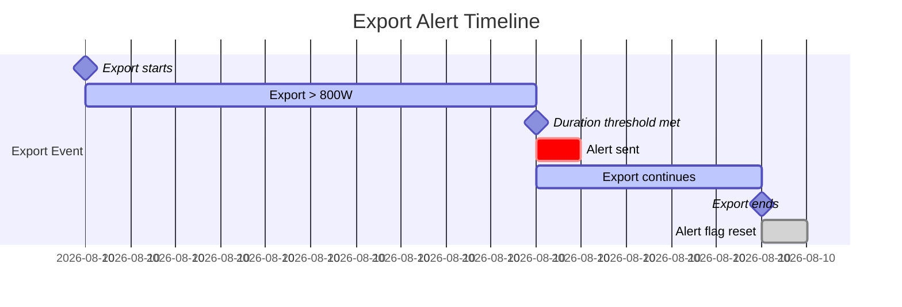
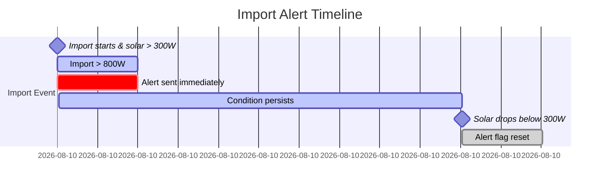

## Overview

Energy Control Pro provides two intelligent alert systems that notify you when energy flow conditions persist beyond configured thresholds. These alerts use Home Assistant's **persistent notification** system, ensuring they remain visible until acknowledged.

<Info>
Alerts trigger only once per event and automatically reset when conditions clear.
</Info>

## Alert Types

The integration monitors two distinct problematic conditions:

### Prolonged Grid Export Alert

Triggered when you're exporting excessive power to the grid for an extended period, indicating unused surplus solar capacity.

**Notification ID**: `energy_control_pro_prolonged_grid_export`

### Import While Solar Available Alert

Triggered when you're importing from the grid despite active solar production, suggesting optimization opportunities.

**Notification ID**: `energy_control_pro_import_while_solar`

## Configuration Parameters

Three key parameters control when alerts trigger:

### Import Threshold

**Configuration Key** (const.py:11, 32):
```python
CONF_IMPORT_THRESHOLD_W = "import_threshold_w"
DEFAULT_IMPORT_THRESHOLD_W = 800
```

Minimum grid import power (in watts) required to consider triggering import alert.

### Export Threshold

**Configuration Key** (const.py:12, 33):
```python
CONF_EXPORT_THRESHOLD_W = "export_threshold_w"
DEFAULT_EXPORT_THRESHOLD_W = 800
```

Minimum grid export power (in watts) required to consider triggering export alert.

### Duration Threshold

**Configuration Key** (const.py:13, 34):
```python
CONF_DURATION_THRESHOLD_MIN = "duration_threshold_min"
DEFAULT_DURATION_THRESHOLD_MIN = 10
```

Minimum duration (in minutes) the condition must persist before triggering an alert.

## Prolonged Export Alert

### Trigger Conditions

**Logic Function** (logic.py:151-164):
```python
def should_trigger_export_alert(
    *,
    grid_export_w: int,
    export_threshold_w: int,
    export_duration_min: int,
    duration_threshold_min: int,
    export_alert_sent: bool,
) -> bool:
    """Return True when export alert should be sent now."""
    return (
        not export_alert_sent
        and grid_export_w > max(0, export_threshold_w)
        and export_duration_min >= max(1, duration_threshold_min)
    )
```

The alert triggers when **all** of these conditions are met:

<Steps>
  <Step title="Not Already Sent">
    Alert hasn't been sent for the current export event (`export_alert_sent == False`)
  </Step>
  
  <Step title="Above Threshold">
    Grid export exceeds configured `export_threshold_w` (default: 800W)
  </Step>
  
  <Step title="Duration Met">
    Export has continued for at least `duration_threshold_min` (default: 10 minutes)
  </Step>
</Steps>

### Notification Creation

**Implementation** (coordinator.py:201-222):
```python
if should_trigger_export_alert(
    grid_export_w=export_w,
    export_threshold_w=export_threshold_w,
    export_duration_min=export_duration_min,
    duration_threshold_min=duration_threshold_min,
    export_alert_sent=self._export_alert_sent,
):
    await self.hass.services.async_call(
        "persistent_notification",
        "create",
        {
            "title": "Energy Control Pro: Prolonged Grid Export",
            "message": (
                f"Grid export is above {export_threshold_w} W for "
                f"{duration_threshold_min} minutes. "
                f"Current: {export_w} W, duration: {export_duration_min} min."
            ),
            "notification_id": "energy_control_pro_prolonged_grid_export",
        },
        blocking=False,
    )
    self._export_alert_sent = True
```

<Card title="Example Notification" icon="bell">
  **Title**: Energy Control Pro: Prolonged Grid Export
  
  **Message**: Grid export is above 800 W for 10 minutes. Current: 1250 W, duration: 12 min.
</Card>

### Alert Reset

**Reset Logic** (coordinator.py:223-226):
```python
self._export_alert_sent = reset_export_alert_if_not_exporting(
    export_alert_sent=self._export_alert_sent,
    energy_state=energy_state,
)
```

**Reset Function** (logic.py:182-190):
```python
def reset_export_alert_if_not_exporting(
    *,
    export_alert_sent: bool,
    energy_state: str,
) -> bool:
    """Reset export alert flag once export event ends."""
    if energy_state != ENERGY_STATE_EXPORTING:
        return False
    return export_alert_sent
```

<Info>
The alert flag resets when energy state changes from "exporting" to "importing" or "balanced", allowing a new alert for subsequent export events.
</Info>

## Import While Solar Alert

### Trigger Conditions

**Logic Function** (logic.py:167-179):
```python
def should_trigger_import_alert(
    *,
    grid_import_w: int,
    solar_w: int,
    import_threshold_w: int,
    import_alert_sent: bool,
) -> bool:
    """Return True when import-with-solar alert should be sent now."""
    return (
        not import_alert_sent
        and grid_import_w > max(0, import_threshold_w)
        and solar_w > 300
    )
```

The alert triggers when **all** of these conditions are met:

<Steps>
  <Step title="Not Already Sent">
    Alert hasn't been sent for the current import event (`import_alert_sent == False`)
  </Step>
  
  <Step title="Significant Import">
    Grid import exceeds configured `import_threshold_w` (default: 800W)
  </Step>
  
  <Step title="Solar Available">
    Solar production exceeds 300W (hardcoded minimum for meaningful solar activity)
  </Step>
</Steps>

<Note>
This alert does **not** require a duration threshold—it triggers immediately when conditions are met.
</Note>

### Notification Creation

**Implementation** (coordinator.py:228-253):
```python
import_condition = (
    import_w > max(0, import_threshold_w) and solar_w > 300
)
if should_trigger_import_alert(
    grid_import_w=import_w,
    solar_w=solar_w,
    import_threshold_w=import_threshold_w,
    import_alert_sent=self._import_alert_sent,
):
    await self.hass.services.async_call(
        "persistent_notification",
        "create",
        {
            "title": "Energy Control Pro: Importing While Solar Available",
            "message": (
                "You are importing energy while solar production is available. "
                f"Import: {import_w} W, Solar: {solar_w} W, "
                f"duration: {import_duration_min} min."
            ),
            "notification_id": "energy_control_pro_import_while_solar",
        },
        blocking=False,
    )
    self._import_alert_sent = True
if not import_condition:
    self._import_alert_sent = False
```

<Card title="Example Notification" icon="bell">
  **Title**: Energy Control Pro: Importing While Solar Available
  
  **Message**: You are importing energy while solar production is available. Import: 950 W, Solar: 1200 W, duration: 3 min.
</Card>

### Alert Reset

**Reset Logic** (coordinator.py:252-253):
```python
if not import_condition:
    self._import_alert_sent = False
```

<Info>
The alert flag resets as soon as import drops below threshold **or** solar production falls below 300W.
</Info>

## Alert Processing Flow

Alerts are processed during every coordinator update cycle:

**Processing Entry Point** (coordinator.py:128, 182-253):
```python
await self._async_process_alerts(data)
```

<Steps>
  <Step title="Read Configuration">
    Load `import_threshold_w`, `export_threshold_w`, and `duration_threshold_min` from options
  </Step>
  
  <Step title="Extract Current Data">
    Get current `solar_w`, `grid_import_w`, `grid_export_w`, `energy_state`, and duration values
  </Step>
  
  <Step title="Check Export Alert">
    Evaluate export conditions and send notification if triggered
  </Step>
  
  <Step title="Reset Export Flag">
    Clear export alert flag if no longer exporting
  </Step>
  
  <Step title="Check Import Alert">
    Evaluate import-while-solar conditions and send notification if triggered
  </Step>
  
  <Step title="Reset Import Flag">
    Clear import alert flag if conditions no longer met
  </Step>
</Steps>

## Alert State Tracking

The coordinator maintains two boolean flags in memory:

**Initialization** (coordinator.py:71-74):
```python
self._import_start: datetime | None = None
self._export_start: datetime | None = None
self._import_alert_sent = False
self._export_alert_sent = False
```

<AccordionGroup>
  <Accordion title="_export_alert_sent" icon="flag">
    Tracks whether the prolonged export alert has been sent for the current export event. Prevents duplicate notifications during the same continuous export period.
  </Accordion>
  
  <Accordion title="_import_alert_sent" icon="flag">
    Tracks whether the import-while-solar alert has been sent. Prevents duplicate notifications while import and solar conditions persist.
  </Accordion>
</AccordionGroup>

## Persistent Notification System

Both alerts use Home Assistant's built-in persistent notification service:

```python
await self.hass.services.async_call(
    "persistent_notification",
    "create",
    {
        "title": "...",
        "message": "...",
        "notification_id": "unique_id",
    },
    blocking=False,
)
```

<Card title="Persistent Notification Benefits" icon="thumbs-up">
  - Remains visible in Home Assistant UI until manually dismissed
  - Accessible via notification panel
  - Can trigger additional automations
  - Supports unique notification IDs to update existing notifications
</Card>

## Dismissing Alerts

Alerts can be dismissed through:

1. **Home Assistant UI**: Click the notification in the notification panel
2. **Service Call**: 
   ```yaml
   service: persistent_notification.dismiss
   data:
     notification_id: energy_control_pro_prolonged_grid_export
   ```
3. **Automatically**: Alerts with the same `notification_id` are replaced when conditions retrigger

## Using Alerts in Automations

You can create automations that respond to these notifications:

### Example: Send Mobile Notification

```yaml
trigger:
  - platform: event
    event_type: call_service
    event_data:
      domain: persistent_notification
      service: create
      service_data:
        notification_id: energy_control_pro_prolonged_grid_export
action:
  - service: notify.mobile_app
    data:
      title: "High Solar Export Detected"
      message: "Consider turning on additional loads to use excess solar power."
```

### Example: Turn On Load When Export Alert Fires

```yaml
trigger:
  - platform: numeric_state
    entity_id: sensor.grid_export_power
    above: 800
    for:
      minutes: 10
condition:
  - condition: state
    entity_id: switch.pool_pump
    state: 'off'
action:
  - service: switch.turn_on
    target:
      entity_id: switch.pool_pump
  - service: notify.mobile_app
    data:
      message: "Turned on pool pump due to high solar export"
```

## Configuration Example

```yaml
import_threshold_w: 500      # Alert when importing > 500W
export_threshold_w: 1000     # Alert when exporting > 1000W
duration_threshold_min: 15   # Require 15 minutes of continuous export
```

<Warning>
Setting thresholds too low may result in frequent nuisance alerts. Consider your typical consumption patterns when configuring.
</Warning>

## Alert Timing

### Export Alert Timeline



### Import Alert Timeline



<Note>
Export alerts require **duration persistence**, while import alerts trigger **immediately** when conditions are met.
</Note>

## Troubleshooting

<AccordionGroup>
  <Accordion title="Alert not triggering" icon="question">
    **Check**:
    - Verify threshold values are appropriate for your system
    - Confirm duration has been met (for export alerts)
    - Check Home Assistant logs for any errors
    - Verify sensor values using Developer Tools > States
  </Accordion>
  
  <Accordion title="Duplicate alerts" icon="clone">
    **Cause**: Alert flag may not be resetting properly
    
    **Solution**: Check that energy state is transitioning correctly. Review `sensor.energy_state` history.
  </Accordion>
  
  <Accordion title="Alerts not clearing" icon="bell-slash">
    **Cause**: Persistent notifications remain until dismissed
    
    **Solution**: Manually dismiss in UI or use `persistent_notification.dismiss` service
  </Accordion>
</AccordionGroup>

## Next Steps

<CardGroup cols={2}>
  <Card title="Energy Monitoring" icon="chart-line" href="/features/energy-monitoring">
    Learn about the sensors that drive alert logic
  </Card>
  <Card title="Load Optimization" icon="gauge-high" href="/features/load-optimization">
    Automatically respond to surplus/import conditions
  </Card>
  <Card title="Configuration" icon="gear" href="/configuration">
    Configure alert thresholds and durations
  </Card>
  <Card title="Troubleshooting" icon="wrench" href="/guides/troubleshooting">
    Resolve alert notification issues
  </Card>
</CardGroup>